# C-head

## 我想说的

这个仓库的名字其实是不太合适的，因为这个仓库本来是储存我编写C语言程序时用于方便地引用一些头文件与使用一些所有程序都能用的功能。  
问题在于以前我的使用方式是直接将源代码复制到每个程序的文件里，叫`C-head`也还算是合理，  
而现在我会将源代码编译成*静态库*与*动态库*后再放入程序文件夹内，所以说现在这个仓库应该叫做`C-lib`。  
而且现在如果想要编译时就能够实现系统间的兼容应该是做不到的了

## 使用方法

要使用本仓库的工具仅需要在程序内引用`include`目录下的`tools.h`文件，并且在编译程序时让编译器链接`lib`目录下编译好的任意一个（对应你系统的）库文件以及链接ncursesw库即可

> `lib`下的库文件是在***x86_64***架构下编译的，如果你的系统架构不是*x86_64*也可以自行编译源代码为库文件或者直接将源代码复制到工程目录（或者其他目录）并在编译时也将该仓库内的源代码也引用上
>
> 而使用动态库与静态库的方法我不再赘述，请自行搜索

## 仓库功能

### 定义了Linux下标准库没有的函数

- `getch()` 不回显的输入函数，可供实现**等待用户输入，输入后无需回车确认让程序继续并且不显示输入的字符**的功能（返回整数值作为字符值）。
- `kbhit` 函数，可以判断当且是否有输入（返回整数值，1有，0无）。
- `kbhitGetchar` 基于`kbhit`函数的基础上加上一些修改能够顺便获取输入的字符，且无需等待输入，不会阻止程序的继续运行。

> 在windows下编译的库不会定义`getch`与`kbhit`函数，而是引入windows的`conio.h`头文件，因为windows内置这两个函数

### 定义了一些宏定义

- `Clear` 用于清屏，但是只是打印字符`\033[2J`清屏，会在屏幕上打印大量的空格，滚动条可以向上翻，可以配合`\033`控制符为程序打上一个底色
- `Clear2` 同样用于清屏，但是是调用系统命令，在Linux下这样会稍慢一些但又干净一些，而在Windows下效果同上，但用系统函数移动光标时会移动到上面的内容，除非使用`\033[%d;%dH`的形式移动光标（但较老的win系统似乎不支持）
- `gotoxy` 本来是用于适配windows用系统函数的方式移动光标的，但是发现windows10下也支持使用`\033`移动光标后就改为了一个宏定义，基本无用。

### 自行编写的通用工具

#### 个人认为最有用的——menu菜单功能

该功能能够在Linux环境下实现屏幕大小对齐（过小的终端不可用）。提供可视化选择。并且可以为选项添加描述，充当半个帮助。选项、描述采用滚动设计，若光标移动到了显示上限但还有选项时会让选项上滚，描述也同理，都是可以翻动的，
并且描述还使用了白底黑字做显示颜色（可能有的终端会显示成黑底黑色），选中项则做反色处理  

> 分支有兼容windows的纯标准C的版本

效果图：

主页：  
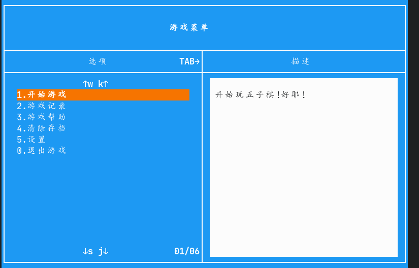
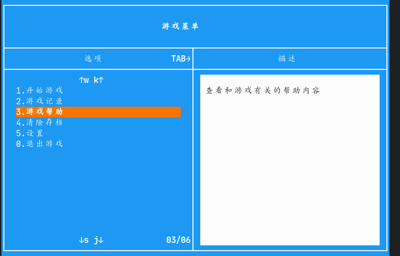

描述：
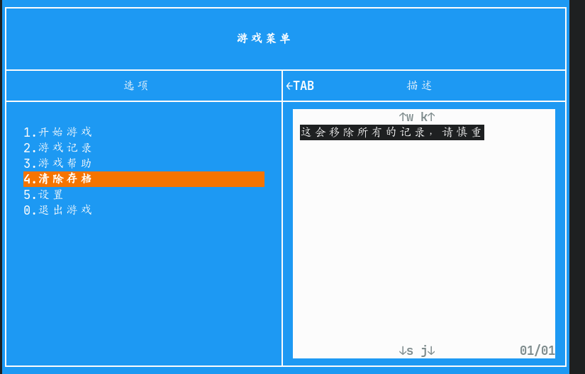

帮助页：
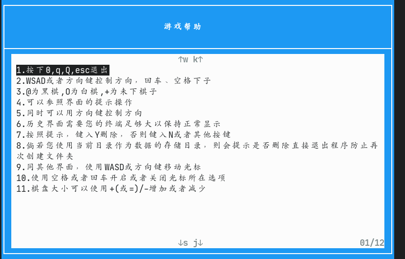
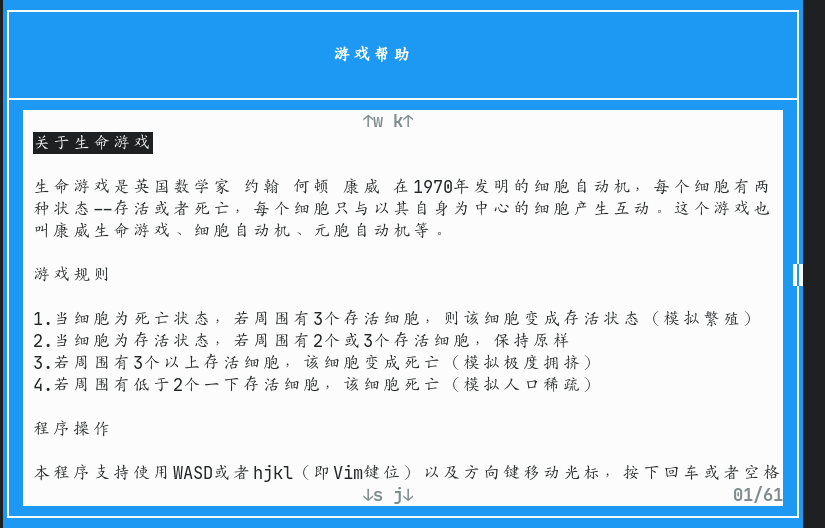
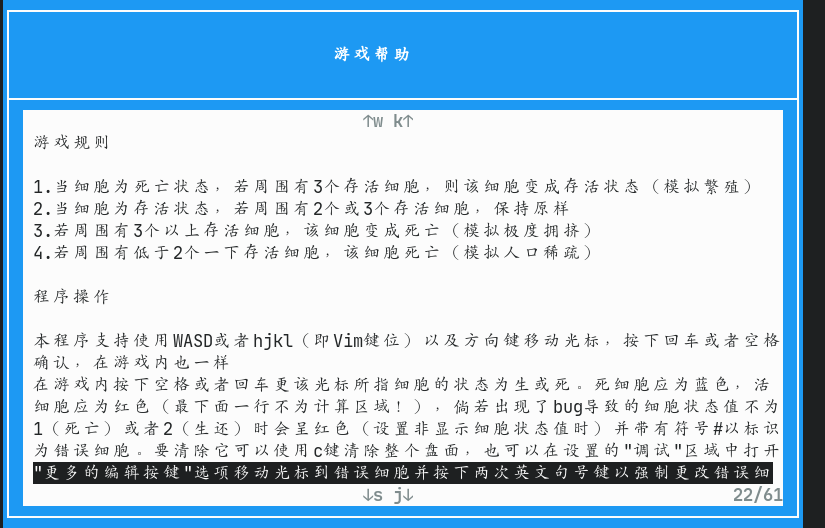

设置页：

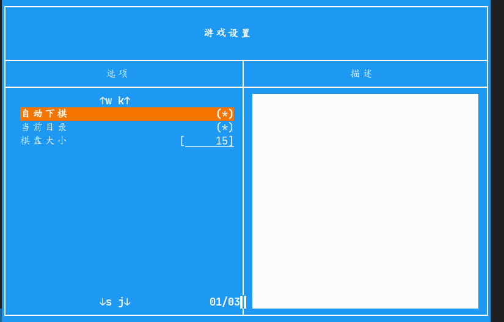
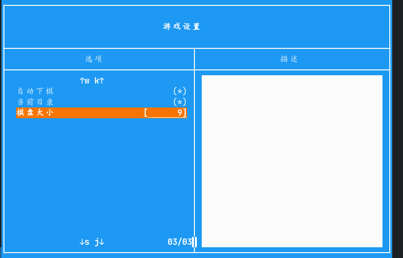

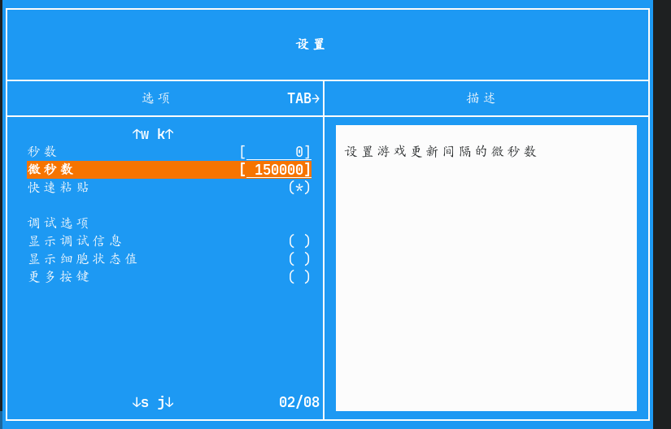

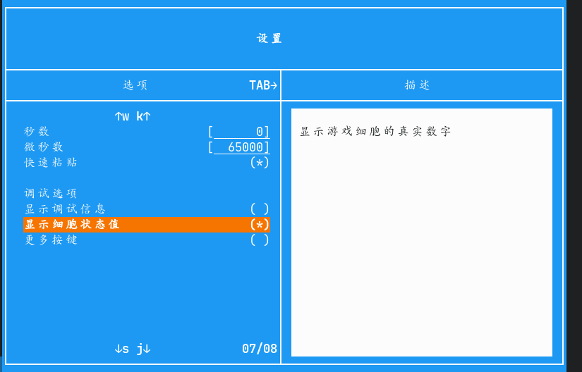
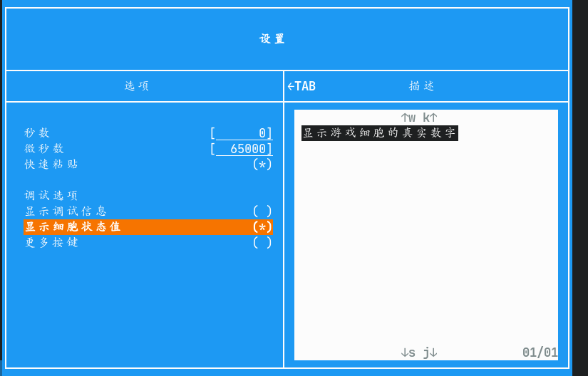

仅显示帮助，无输入处理：
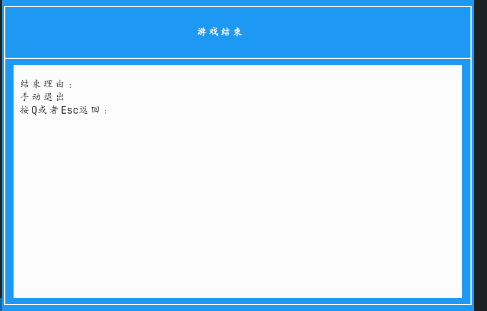
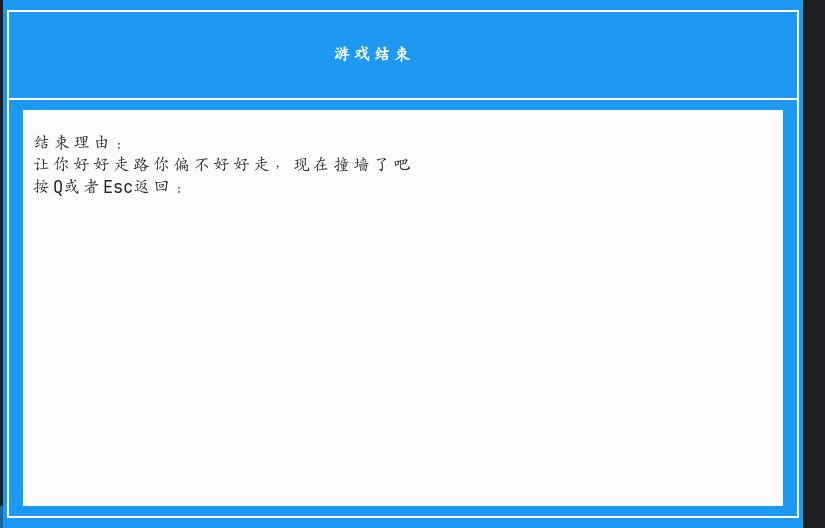


##### 功能介绍：功能的基本结构——结构体

该功能并非仅有一个函数，而是由多个函数组成

为确保该功能能够拥有较好的扩展性，我使用了些面向对象的思想，定义了两个结构体，其中有一个还是是使用了`typedef`加以修饰的

```c
struct Text {
	char        * text;         /* 条例内容 */
	char        * describe;     /* 描述/帮助信息 */
	void       (* function);    /* 调用的函数 */
	int         * var;          /* 调整的变量值 */
	int           number;       /* 编号 */
	int           cfg;          /* 类型：1数值，2开关 */
	int           foot;         /* 设置的步长 */
	int           max;          /* 设置的最大值 */
	int           min;          /* 设置的最小值 */
	struct Text * nextText;     /* 下一条例（链表） */
};                                  /* 条例结构体 */

typedef struct _ctools_menu_t{
	char        * title;    /* 标题 */
	struct Text * text;     /* 条例链表头 */
	struct Text * focus;    /* 选中的条例 */
	int           cfg;      /* 菜单类型: 0.默认 1.仅显示主界面 2.显示帮助 3.显示设置 4.仅显示帮助，无输入处理 */
} ctools_menu_t;                /* 菜单类/结构体 */

/* 初始化ncurse，设置语言、颜色对 */
extern void ctools_menu_Init();
/* 初始化变量 */
extern void ctools_menu_t_init(ctools_menu_t ** tmp);
/* 添加选项 */
extern void ctools_menu_AddText(ctools_menu_t * data, ...);
/* 添加描述信息 */
extern void ctools_menu_AddTextData(ctools_menu_t * data, int type, char * format, ...);
/* 移动焦点变量到指定节点 */
extern void ctools_menu_GetFocus(ctools_menu_t * data, int number);
/* 显示菜单 */
extern int  ctools_menu_Show(ctools_menu_t * data);
```

上面是对外公开的所有内容。  
我们可以将类型`menuData`看作一个"类"，这个类有着各种属性与方法（函数指针），
在使用菜单时需要定义一个`menuData`型的变量并调用`menuDataInit`函数用于为变量初始化。

一下是对各个属性的说明：

- 为`title`赋值定义标题
- 为`cfg`赋值设置菜单类型
  - 0 默认
  - 1 仅显示主界面
  - 2 帮助模式
  - 3 设置模式
  - 4 仅显示帮助，无输入处理
- `text`用于组成链表以储存选项及其信息
  - `text` 储存选项
  - `describe` 保存选项的描述信息
  - ~~`function` 用于指向要调用的函数~~（未实装）
  - `var` 用于指定菜单类型为设置时该选项要调整的变量
  - `number` 在链表中的编号
  - `cfg` 配置在主菜单类型为设置时的选项类型，1数值，2开关
  - `foot` 用于指定菜单类型为设置时且该选项的类型为数值时该选项要调整的变量数值的步长
  - `nextText` 指定下一个节点
- `focus` 用于指向正在操作的节点，用于方便操作
- 调用`addText`为`text`添加选项
- 调用`addTextData`为`text`中的各个选项设置属性。
  - 第二参数
    - 0 添加描述
    - 1 设置类型/选项
    - 2 设置调整的变量
    - 3 设置步长
    - ~~4 设置函数~~（未测试）
  - 第三参数：控制字符串
    - `%s` 用于告诉程序将未使用的参数分配给第N个节点（N从1算起）
    - `n` 用于跳过节点（大小写通用）
    - 示例：`"%s %s N %s N N N %s"`  
      将参数一次写入到第一、第二、（第三被跳过）、  
      第四、（第五六七节点被跳过）、第八节点
- 调用`menuShow`开始菜单程序
- 调用`getFocus` 用于移动`focus`指向的节点

##### 实际使用

参考使用代码：

```c
#include "/path/to/file/tools.h"    //引用头文件

int main() {
	int input;    //用于保存输入的字符
	ctools_menu_t * data = NULL;    //这里指针名字任意，但一定要赋值为NULL

	// 初始化指针（申请空间、赋值）
	ctools_menu_t_init(&data);

	//设置菜单的标题（以前留空会直接挂，现在可以留空）
	data->title = "这里填写你的标题";

	//这里是设置类型，一般不用设置，因为已经初始化了
	data->cfg   = 0;

	//一定要先添加选项再添加描述
	//一定要在参数的最后加上NULL作为结束符
	ctools_menu_AddText(data, "选项1", "选项2", "选项n", NULL);

	//谈及选项数据（条数不能超过选项的条数）
	//第三个参数是控制字符串，%s的数量不可以超过节点的数量
	ctools_menu_AddTextData(data, 0, "%s", "这是一条描述");

	//调用函数显示菜单，并保存返回值
	input = ctools_menu_Show(data);

	//输入处理等。。。
	//.........
	endwin();
}
```

##### 操作介绍

移动按键支持三套：

- WASD
- hjkl（Vim的键位）
- 直接使用方向键（仅限Linux）

使用`Tab`键在选项与描述间跳转

使用空格或者回车确认选项或者输入对应的数字

使用`Esc`、`q`、`0`键可以退出菜单（会返回整型的0）

在设置页中，光标在数值型选项上时使用`+`或`=`增加或使用`-`减少指定的`foot`变量值（默认为1）。
在开关型选项上使用空格或者回车控制选项的状态为开或者关

#### 其他早期菜单

- `Menu` 函数，用于打印一个简陋的菜单界面，并在一定的程度上提供可视化选择（高亮当前选中项，回车、空格确认，或者直接输入要选择的数字），程序会统一返回对应的字符值（不是整数值！）  
  > cgame2程序效果图
  > 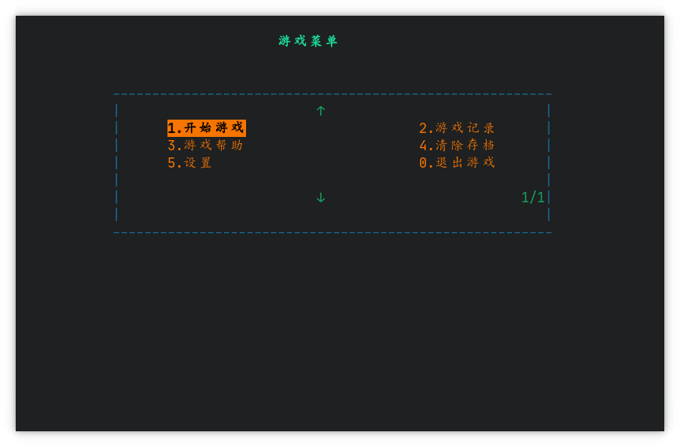
  > 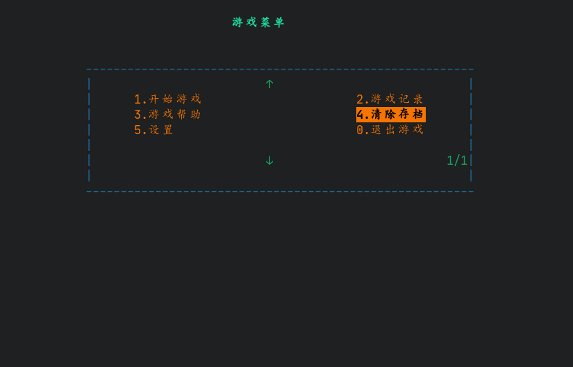
  > 使用的相关代码
  >
  > ```c
  > char *text[] = {    //用作储存要显示的选项
  >	"选项1",
  >	"选项2",
  >	".....",
  >	"选项n"
  > }
  > Menu("菜单标题", text, allChose, allList);    //allChose为总选项数，allList为列数
  > ```

- `Menu2` 用于打印菜单的边框
  > cgame2程序效果图
  > 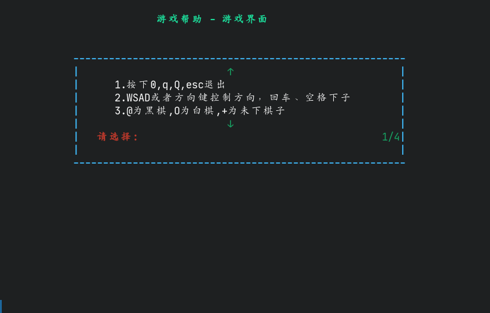
  > 其中的选项内容为程序额外添加的，

- `Menu3` 与`Menu2`函数区别不大，主要就是没有翻页提示以及提示语变为了`按任意键返回`

